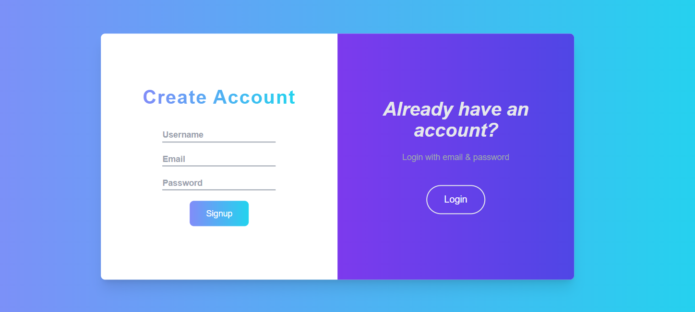
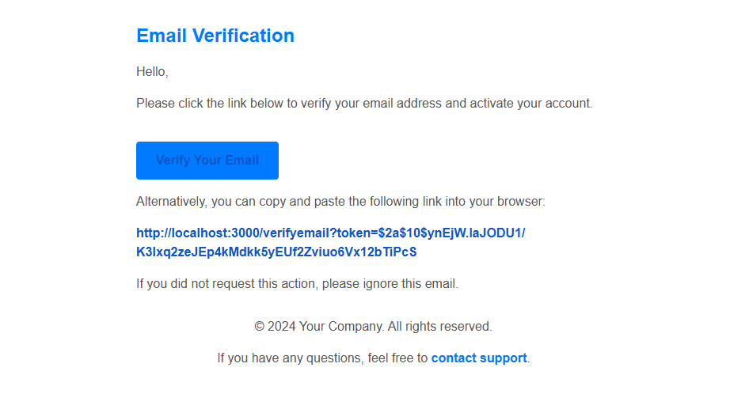
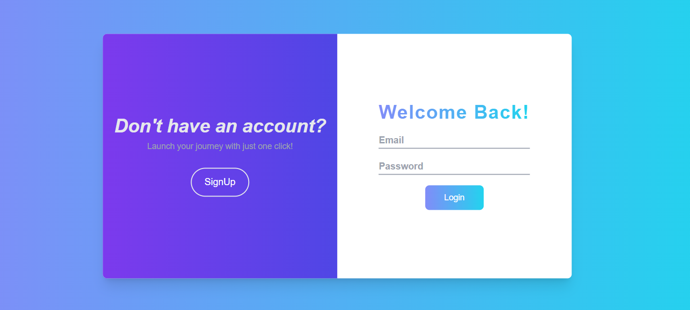

# User Authentication with Email Verification

This project is a user authentication system built using **Next.js** and **TypeScript**, which includes email verification as a key feature to ensure secure user registration. The system enables users to sign up, log in,log out and verify their email addresses for added security.

## Features

- **Sign Up:** Users can create an account using their email and password.
- **Email Verification:** After signing up, users receive a verification email to activate their account.
- **Login:** Users can log in after verifying their email.
- **Secure Passwords:** User passwords are hashed for security.
- **Responsive Design:** Fully responsive for both desktop and mobile views.

## Technology Stack

- **Next.js**: React framework for building server-side rendered applications.
- **TypeScript**: Strongly typed JavaScript for better development experience.
- **Node.js**: Backend for handling server-side logic.
- **MongoDB**: Database for storing user information.
- **Nodemailer**: For sending email verification links.
- **bcrypt**: To hash passwords for secure storage.

## Screenshots

Here are some screenshots to showcase the application:

- **Sign Up Screen:**

  

- **Email Verification:**

  

- **Login Screen:**

  


## Prerequisites

Before running this project, ensure you have the following installed:

- **Node.js** (v16 or later)
- **MongoDB** (local or cloud instance)
- **Environment Variables**: Add these to a `.env.local` file:
  ```plaintext
  NEXT_PUBLIC_BASE_URL=http://localhost:3000
  MONGO_URI=your_mongodb_connection_string
  EMAIL_SERVICE=your_email_service
  EMAIL_USER=your_email_address
  EMAIL_PASS=your_email_password
  JWT_SECRET=your_secret_key

## Getting Started

Follow these steps to get a local copy of the project up and running:

### Cloning the Repository

1. Clone the repository:
   ```bash
   git clone https://github.com/Abdul-Raheem324/User-Authentication.git

